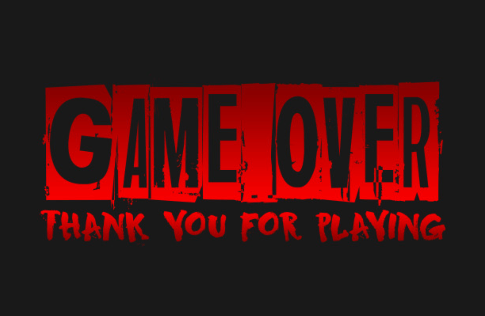

# JS | Canvas Snake

## Introduction

`Build Snake game canvas`

## 1. First iteration: Create class Game and Draw background

- Create a **_<canvas_>** element.
- Get the reference to canvas(context).
- Define box size.
- We need to measure what size width and height of a canvas. And make sure that
  is divisible to our snake boxes, through which our snake will be moving. Also
  we gonna make our snake width and height same size as this boxes in the canvas
  (see the image below).

- There 2 options. Ether we can use image like in below or we can draw our
  custom grid. I did custom, so if I need I can change my grid length on any
  axes, as well as it's boxes width and height. For example, 20x20 or 20x40.
  Mine is 30x21. From top I left 2 box size and all other sides 1 box size to
  make it look nice. So my snake will be running in 28x18(x=28,y=18).
- my snake width=height=eachBox=30.

## 2. Second Iteration: Make class Snake and Draw the Snake

- Create snake array where we'll be storing our snake body.
- Define first element for snake array(body).
- Using for loop draw first element in the canvas.
- Define snake direction = undefined for now. This direction we will use in this
  Snake class to define which way our snake should go Once we have our snake, we
  will make Player where Player will extend Snake to have a full control of the
  snake. In the Player class we'll just need to add remote control and set
  direction of the snake if certain key pressed.

## 3. Third Iteration: Make Player class move the snake right, left, up and down

- class Player extends Snake. Now we have access to our Snake class to
  manipulate.
- Using eventListener set the snake direction to left,up,right or down(Key arrow
  codes 37,38,39,40).
- Also we have to make sure that our snake cannot go left if it's direction
  right,and other way back . Also it cannot go up if it's direction down(heading
  down) to avoid our snake going backwards. Because the snake goes only forward.
  Ones our snake is moving we can go ahead and make the food for it or we can
  make border collision. Let's create a food.

## 4. Fourth Iteration: Create Food class

- In this class we'll have width and height as a properties of the Food and
  random x, y position.
- Draw Food

Our food also will have the same width and height as the snake to fit in the
boxes.

## 5. Fifth Iteration: Make the snake eat the food (collision with food)

- When snake collide with food:

  - randomize the food
  - increase the length of our snake
  - add score

  To make this part is little tricky. What I did was,since we're drawing our
  snake in every frame in different position to make the move. We skip one frame
  when eats food to extend snakes length. After collision with food we start pop
  the tail of the snake and unshift to the front of the snake array.

## 6. Sixth Iteration: Self and border collision:

- When collision: 

## 7. Seventh Iteration: Create sound:

- When snake eats food
- When collision

To be able to use it in every file we can make separate Sound class for sounds.

## 8. Eighth Iteration: Create buttons:

- Create start button
- Create restart button
- Create exit button
  - add game over score There 2 options for restart and exit buttons:
  - one is to create them in the HTML and hide
  - another create them at the time of collision and delete after reset

## 9. Ninth Iteration: Create a second player:

## 10. Tenth Iteration: Create a players collision:
